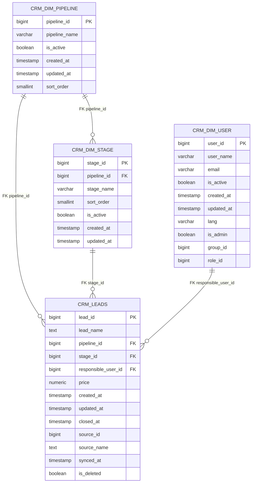

# DER — VIAJERO DATA PLATFORM

## 1. Propósito

Este documento representa el modelo de datos actual de **VIAJERO DATA PLATFORM**, basado en la estructura física existente en PostgreSQL.

El objetivo es documentar:

- Tablas existentes.
- Claves primarias.
- Claves foráneas implementadas.
- Relaciones entre los esquemas `staging`, `crm` y `audit`.
- Relaciones lógicas que todavía no están implementadas como FK.
- Elementos pendientes de evolución del modelo.

> **Fuente de verdad:** estructura física actual de PostgreSQL.
>
> Las relaciones representadas como FK corresponden únicamente a restricciones realmente existentes en la base de datos.

---

# 2. Arquitectura lógica

La plataforma sigue actualmente este flujo:

```text
Kommo CRM
    │
    ▼
n8n
    │
    ▼
STAGING
    │
    ▼
CRM
    │
    ▼
DWH / Reporting
```

Actualmente el modelo físico consolidado se encuentra principalmente en los esquemas:

- `staging`
- `crm`
- `audit`

El esquema `dwh` se encuentra reservado para la futura capa analítica.

---

# 3. Diagrama Entidad-Relación



---

# 4. Modelo `CRM`

## 4.1 `crm.dim_pipeline`

Catálogo de pipelines provenientes de Kommo.

### Clave primaria

```text
pipeline_id
```

### Columnas

| Campo | Tipo | Nulo |
|---|---|---|
| pipeline_id | bigint | NO |
| pipeline_name | varchar | NO |
| is_active | boolean | NO |
| created_at | timestamp | NO |
| updated_at | timestamp | NO |
| sort_order | smallint | SÍ |

### Relaciones

Es entidad padre de:

- `crm.dim_stage`
- `crm.leads`

---

## 4.2 `crm.dim_stage`

Catálogo de etapas de los pipelines.

### Clave primaria

```text
stage_id
```

### Clave foránea

```text
pipeline_id
    → crm.dim_pipeline.pipeline_id
```

### Columnas

| Campo | Tipo | Nulo |
|---|---|---|
| stage_id | bigint | NO |
| pipeline_id | bigint | NO |
| stage_name | varchar | NO |
| sort_order | smallint | SÍ |
| is_active | boolean | NO |
| created_at | timestamp | NO |
| updated_at | timestamp | NO |

### Integridad referencial

FK existente:

```text
fk_stage_pipeline
```

---

## 4.3 `crm.dim_user`

Catálogo de usuarios de Kommo.

### Clave primaria

```text
user_id
```

### Columnas

| Campo | Tipo | Nulo |
|---|---|---|
| user_id | bigint | NO |
| user_name | varchar | NO |
| email | varchar | SÍ |
| is_active | boolean | NO |
| created_at | timestamp | NO |
| updated_at | timestamp | NO |
| lang | varchar | SÍ |
| is_admin | boolean | SÍ |
| group_id | bigint | SÍ |
| role_id | bigint | SÍ |

---

## 4.4 `crm.leads`

Entidad principal de oportunidades/leads sincronizados desde Kommo.

### Clave primaria

```text
lead_id
```

### Claves foráneas

```text
pipeline_id
    → crm.dim_pipeline.pipeline_id

stage_id
    → crm.dim_stage.stage_id

responsible_user_id
    → crm.dim_user.user_id
```

### Columnas

| Campo | Tipo | Nulo |
|---|---|---|
| lead_id | bigint | NO |
| lead_name | text | SÍ |
| pipeline_id | bigint | SÍ |
| stage_id | bigint | SÍ |
| responsible_user_id | bigint | SÍ |
| price | numeric | SÍ |
| created_at | timestamp | SÍ |
| updated_at | timestamp | SÍ |
| closed_at | timestamp | SÍ |
| source_id | bigint | SÍ |
| source_name | text | SÍ |
| synced_at | timestamp | SÍ |
| is_deleted | boolean | NO |

### Integridad referencial

FK existentes:

```text
fk_leads_pipeline
fk_leads_stage
fk_leads_user
```

---

## 4.5 `crm.leads_assignment`

Tabla utilizada para información relacionada con la asignación/procesamiento de leads.

### Clave primaria

```text
id
```

### Columnas

| Campo | Tipo | Nulo |
|---|---|---|
| id | bigint | NO |
| lead_id | bigint | SÍ |
| lead_name | text | SÍ |
| pipeline_name | text | SÍ |
| stage_name | text | SÍ |
| origin_data | text | SÍ |
| responsible | text | SÍ |
| created_at | timestamp | SÍ |
| extracted_at | timestamp | SÍ |
| pipeline_id | bigint | SÍ |
| stage_id | bigint | SÍ |
| responsible_user_id | bigint | SÍ |

### Estado de relaciones

Actualmente esta tabla **no tiene FK** hacia:

- `crm.leads`
- `crm.dim_pipeline`
- `crm.dim_stage`
- `crm.dim_user`

Los campos `lead_id`, `pipeline_id`, `stage_id` y `responsible_user_id` representan relaciones lógicas, pero no restricciones de integridad referencial física.

---

# 5. Modelo `STAGING`

## 5.1 `staging.leads_raw`

Capa de recepción de los datos crudos provenientes de Kommo.

### Clave primaria

```text
id
```

### Columnas

| Campo | Tipo | Nulo |
|---|---|---|
| id | bigint | NO |
| lead_id | bigint | SÍ |
| source_system | varchar | SÍ |
| payload | jsonb | SÍ |
| extracted_at | timestamp | SÍ |
| processed_at | timestamp | SÍ |
| is_processed | boolean | NO |

### Relación lógica

```text
staging.leads_raw.lead_id
        │
        ▼
crm.leads.lead_id
```

Esta relación es lógica y **no está implementada como FK**.

Esto es intencionalmente compatible con la función de staging como capa desacoplada de recepción de datos.

---

## 5.2 `staging.sync_control`

Control de sincronización incremental por entidad.

### Clave primaria

```text
entity
```

### Columnas

| Campo | Tipo | Nulo |
|---|---|---|
| entity | text | NO |
| last_sync | timestamp | NO |

Actualmente se utiliza para mantener el punto de sincronización de procesos incrementales.

---

# 6. Modelo `AUDIT`

## 6.1 `audit.etl_execution_log`

Registro de ejecuciones de procesos ETL/sincronización.

### Clave primaria

```text
id
```

### Columnas

| Campo | Tipo | Nulo |
|---|---|---|
| id | bigint | NO |
| process_name | varchar | SÍ |
| started_at | timestamp | SÍ |
| status | varchar | SÍ |
| records_processed | integer | SÍ |
| observations | text | SÍ |

Actualmente no posee relaciones FK con las tablas de `crm` o `staging`.

---

# 7. Relaciones físicas implementadas

Actualmente PostgreSQL tiene las siguientes FK:

| FK | Tabla origen | Campo | Tabla destino | Campo |
|---|---|---|---|---|
| `fk_stage_pipeline` | `crm.dim_stage` | `pipeline_id` | `crm.dim_pipeline` | `pipeline_id` |
| `fk_leads_pipeline` | `crm.leads` | `pipeline_id` | `crm.dim_pipeline` | `pipeline_id` |
| `fk_leads_stage` | `crm.leads` | `stage_id` | `crm.dim_stage` | `stage_id` |
| `fk_leads_user` | `crm.leads` | `responsible_user_id` | `crm.dim_user` | `user_id` |

Estas son las únicas relaciones FK del modelo CRM identificadas en la auditoría actual.

---

# 8. Relaciones lógicas sin FK

Existen vínculos utilizados por los procesos de datos que actualmente no están implementados mediante restricciones de PostgreSQL.

### Staging → CRM

```text
staging.leads_raw.lead_id
        ↓
crm.leads.lead_id
```

### Assignment → CRM

```text
crm.leads_assignment.lead_id
        ↓
crm.leads.lead_id
```

```text
crm.leads_assignment.pipeline_id
        ↓
crm.dim_pipeline.pipeline_id
```

```text
crm.leads_assignment.stage_id
        ↓
crm.dim_stage.stage_id
```

```text
crm.leads_assignment.responsible_user_id
        ↓
crm.dim_user.user_id
```

Estas relaciones no deben considerarse integridad referencial física hasta que se implementen las correspondientes FK.

---

# 9. Entidades pendientes

## 9.1 Contacts

Actualmente no existe una tabla:

```text
crm.contacts
```

ni una tabla de relación:

```text
crm.lead_contacts
```

La incorporación de Contacts queda pendiente.

Antes de implementar estas tablas se debe validar la estructura real de la respuesta de Kommo y la cardinalidad de la relación Lead ↔ Contact.

No se debe asumir una relación 1:1.

---

## 9.2 Data Warehouse

El esquema:

```text
dwh
```

queda reservado para la futura capa analítica.

No se crean entidades DWH en este documento hasta que exista una implementación física.

---

# 10. Convenciones del modelo

## Staging

Responsable de conservar la información recibida desde sistemas externos en formato crudo.

Características:

- JSONB.
- Datos originales.
- Procesamiento incremental.
- Control de procesamiento.
- Desacoplamiento respecto al modelo CRM.

## CRM

Modelo relacional normalizado de las entidades provenientes de Kommo.

Características:

- PK.
- FK.
- UPSERT.
- Soft delete cuando aplica.
- Catálogos/dimensiones.
- Datos estructurados para consumo posterior.

## DWH

Capa destinada al modelo analítico.

Actualmente reservada para una etapa posterior.

## Audit

Capa destinada al seguimiento de ejecuciones de procesos ETL y sincronización.

---

# 11. Estado actual del modelo

| Componente | Estado |
|---|---|
| Pipelines | Implementado |
| Stages | Implementado |
| Users | Implementado |
| Leads | Implementado |
| Staging Leads | Implementado |
| Control incremental | Implementado |
| ETL Audit | Implementado |
| Leads Assignment | Implementado |
| Contacts | Pendiente |
| Relación Lead ↔ Contact | Pendiente |
| Companies | Pendiente |
| DWH | Reservado / pendiente |
| Migrations versionadas | Pendiente |

---

# 12. Próxima evolución

La siguiente etapa del modelo será incorporar Contacts.

El diseño deberá resolver:

1. Extracción de Contacts desde Kommo.
2. Staging de Contacts.
3. Modelo `crm.contacts`.
4. Identificación de la relación Lead ↔ Contact.
5. Integración de campos de Contact necesarios para reporting.
6. Sincronización incremental.
7. UPSERT.
8. Soft delete.
9. Validación de cardinalidad.
10. Integración posterior con los reportes comerciales y demográficos.

Para el análisis de compradores se requieren especialmente:

```text
Contact
├── 1008538 → Ciudad
└── 1020420 → Fecha de nacimiento
```

La asociación con el comprador se realizará a partir del `lead_id` correspondiente a la venta.

---

# 13. Regla de auditoría del DER

Este documento debe mantenerse sincronizado con la estructura física de PostgreSQL.

No se deben documentar como FK relaciones que solamente existan en código, n8n o consultas SQL.

Cuando se modifique el modelo físico:

1. Actualizar la estructura de PostgreSQL.
2. Actualizar este DER.
3. Validar las relaciones.
4. Hacer commit en Git.

El DER es documentación técnica versionada y debe reflejar el estado real de la base de datos.
